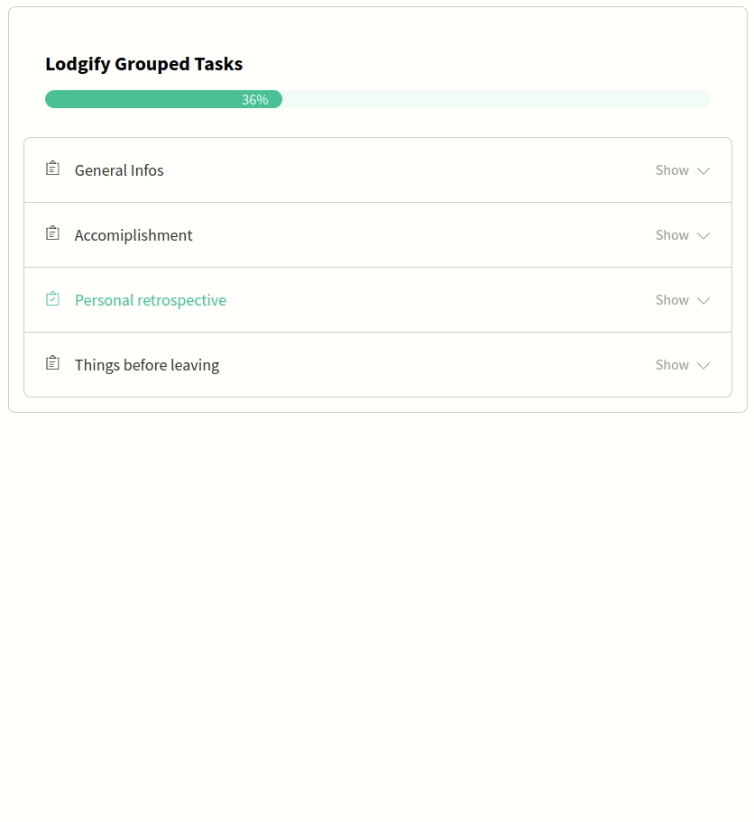

# Task Widget

This is a widget that shows the current progress of the profile creation of the user.
#### [DEMO](https://orivelton.github.io/task-widget/)



## Available Scripts

In the project directory, you can run:

### `npm start`

Runs the app in the development mode.\
Open [http://localhost:3000](http://localhost:3000) to view it in your browser.

### `npm test`

Launches the test runner in the interactive watch mode.

## `npm run test -- --coverage`

Launches the test coverage

### `npm run build`

Builds the app for production to the `build` folder.\
It correctly bundles React in production mode and optimizes the build for the best performance.

## Files and Folder

```
├── package.json
├── public
│   ├── demo.gif
│   ├── favicon.ico
│   ├── index.html
│   ├── logo192.png
│   ├── logo512.png
│   ├── manifest.json
│   └── robots.txt
├── README.md
└── src
    ├── App.js
    ├── App.test.js
    ├── assets
    │   └── images
    │       ├── arrow-down.svg
    │       ├── arrow-up.svg
    │       ├── loading.svg
    │       └── task-icon.svg
    ├── components
    │   ├── Accordion
    │   │   ├── AccordionStyle.scss
    │   │   ├── index.js
    │   │   └── __tests__
    │   │       └── Accordion.test.js
    │   ├── ProgressBar
    │   │   ├── index.js
    │   │   ├── ProgressBarStyle.scss
    │   │   └── __tests__
    │   │       └── ProgressBar.test.js
    │   ├── TaskList
    │   │   ├── index.js
    │   │   ├── TaskListStyle.scss
    │   │   └── __tests__
    │   │       └── TaskList.test.js
    │   └── TaskProvider
    │       └── index.js
    ├── helpers
    │   ├── api.js
    │   ├── helper.js
    │   └── __tests__
    │       ├── api.test.js
    │       └── helper.test.js
    ├── hooks
    │   └── task-context.js
    ├── index.js
    ├── mock
    │   └── mockFetch.js
    ├── reportWebVitals.js
    ├── setupTests.js
    └── styles
        └── index.scss
```
